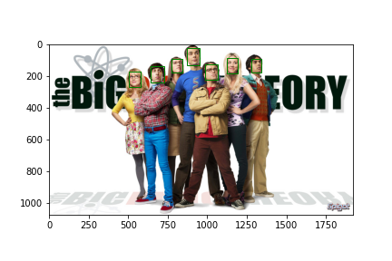

#### --------------------------------------------------------------------------------------------------------------------------------------------------------

## Pre Coding Period

- After spending days and days searching for a jekyll theme for my blog, I finally found an amazing theme. So, here it is, start of my first blog.

- Last week I was little busy with my ongoing Internship & other stuff, I'm still exploring `Milvus Database`. No great updates but Slow & Steady wins the Race 😉️!

#### --------------------------------------------------------------------------------------------------------------------------------------------------------

### Week 1

- Face detection and alignment are important early stages of a modern face recognition pipeline.
- Completed the procudure of `Face Detection` using MTCNN(Multi-Task Cascaded Convolutional Neural Networks).
- Tested the detection algorithm on various images & faces.

#### **Face Detection Results:**

 

#### **Colab Notebook Link:**
[https://colab.research.google.com/drive/1WOPVxNc33eonhDD4gX2VGQ8zofbKm3fF?usp=sharing](https://colab.research.google.com/drive/1WOPVxNc33eonhDD4gX2VGQ8zofbKm3fF?usp=sharing)

#### --------------------------------------------------------------------------------------------------------------------------------------------------------

### Week 2

Coming Soon ...